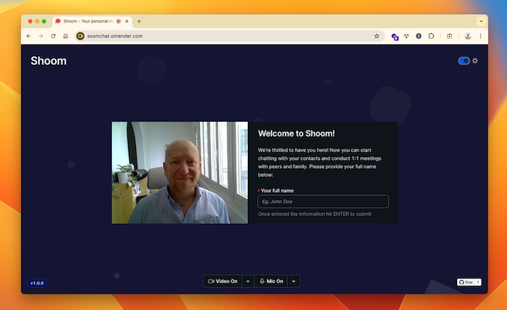
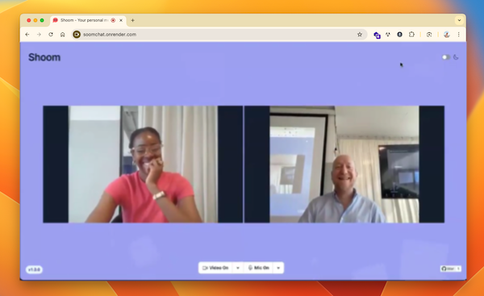

# Welcome to Shoom

Shoom is a simple WebRTC video chat application built with Vite, React, TypeScript, Node.js with Express, and Socket.io. This project facilitates peer-to-peer communication through Web Sockets for signaling and leverages the WebRTC API for real-time media streaming, and Twilio Paste to provide a state-of-the-art UI/UX.



## Features

- Real-time video and audio communication.
- Peer-to-peer connection discovery using Socket.io.
- Intuitive user interface built on top of Twilio Paste with TypeScript.
- Scalable backend with Node.js and Express.
- Optimized development workflow with Vite.



## Prerequisites
To run this application, you need to have Node.js installed on v20 or higher.

## Getting Started

Follow these instructions to get a copy of the project up and running on your local machine for development and testing purposes.

### Installation
1. Clone the repository:

```bash
git clone https://github.com/deeleman/shoom.git
cd shoom
```

2. Install dependencies:

This project recommends to use `yarn install` for dependency installation and management. Alternatively you cna use `npm install` or `pnpm`.

## Development

To run the application in development mode with hot-reloading for both frontend and backend:

```bash
yarn dev
```

This command will concurrently spin up the Node.js backend in watch mode and the React frontend, allowing for a smooth development experience.

### Building for Production
To generate the optimized production-ready bundle of the frontend application:

```bash
yarn build
```
This command compiles the React application into static assets ready for deployment.

### Running in Production
After building the application, you can start the Node.js server in production mode:

```bash
yarn start
```

This command will serve the built frontend assets and run the Node.js backend.

## Testing
Vitest has been configured for unit testing, although there are no tests implemented yet.

To run the test suite and check code coverage:

```bash
yarn coverage
```

This command will run Vitest in a separate process and provide a report on the current code coverage.

If you're only interested on testing your code as you go, run `yarn test`. This will spin up Vitest in _watch mode_, conducting a full run of all the application tests and then re-run only those tests involved in changes introduced thereafter.

## Code Quality
To ensure code quality and consistency, the project uses [ESLint](https://eslint.org/).

To review the code for potential issues:

```bash
yarn lint
```

## Technologies Used
#### Frontend:
- [Vite](https://vitejs.dev/)
- [React](https://react.dev/)
- [TypeScript](https://www.typescriptlang.org/)
- [WebRTC API](https://developer.mozilla.org/en-US/docs/Web/API/WebRTC_API)
- [Socket.io-client](https://socket.io/)
- [Twilio Paste](https:paste.twilio.design)

#### Backend:
- [Node.js](https://nodejs.org/en/)
- [Express](https://expressjs.com/)
- [Socket.io](https://socket.io/)

#### Testing:
- [Vitest](https://vitest.dev/)

#### Package Manager:
- [Yarn](https://yarnpkg.com/) (recommended)
- [npm](https://www.npmjs.com/)

#### Code Quality:
- [ESLint](https://eslint.org/)

## License
This project is licensed under the MIT License - see the [LICENSE.md](LICENSE.md) file for details.